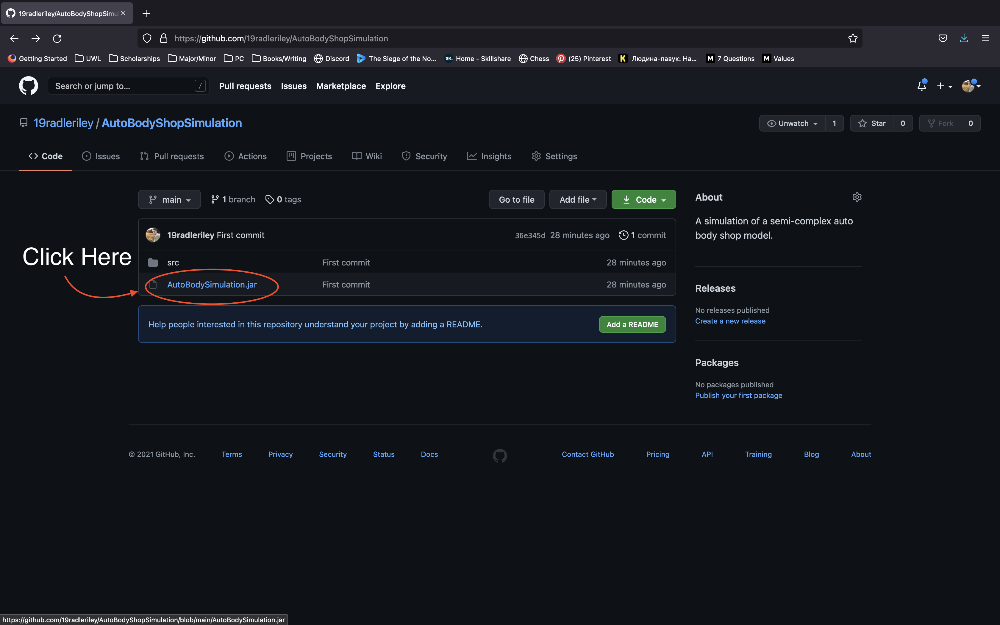
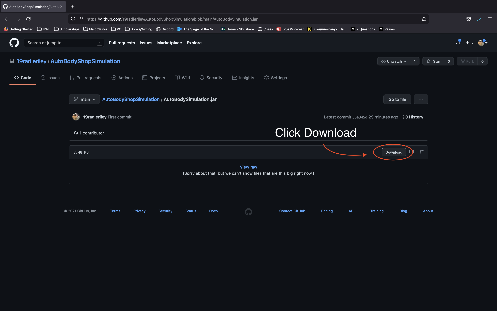
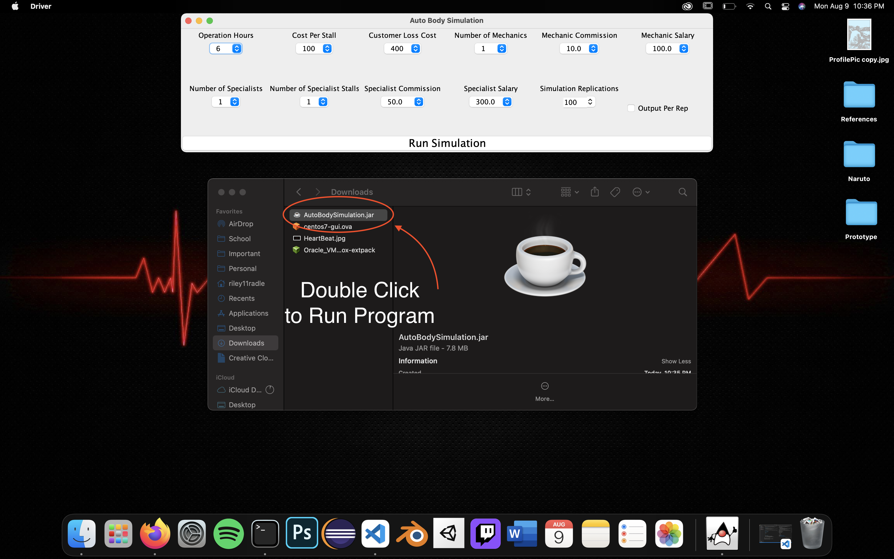
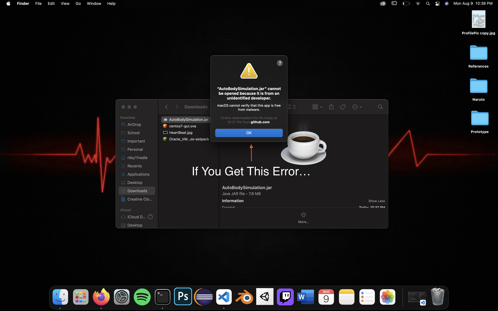
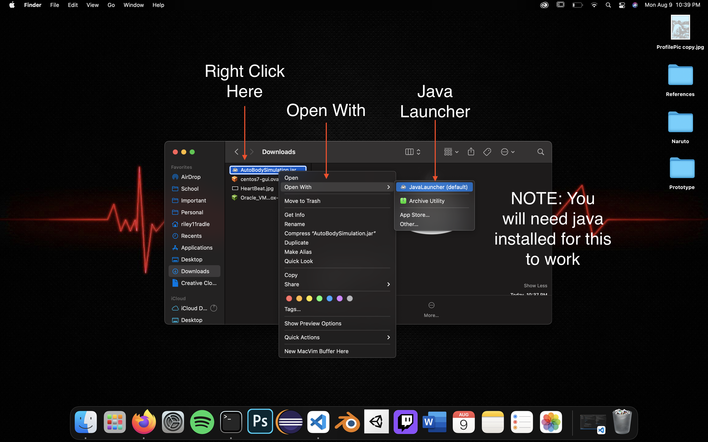

# *Auto Body Shop Simulation*

## Description
__*A simulation of a somewhat complex auto body shop written in Java*__  
This was a project I worked on after taking a simulation class my sophomore year of  
college. In this class I learned basic Monte Carlo simulation, modeling, simulation  
software such as Desmo-J, random number and random variate generation, and basic output  
analysis.  These tools allowed me to create a semi-complex simulation in Java using the  
Desmo-J framework.  I thought this project would adequately showcase my skills as  
simulation is a valuable tool that has many real world applications. The model I came up  
with is based on the final project we needed to complete for the class.  

## Running the Project 
1. Download the AutoBodySimulation.jar file
2. Once downloaded, double click on the AutoBodySimulation.jar file to start the program
3. Configure the simulation settings using the drop-down menus
4. Click "Run Simulation" to run the simulation  

__*NOTE*__: Running the simulation with many replications will increase the time the  
program takes to run and generate the results.  Above 1000 repetitions is not recommended.

## Model Description
The model in this simulation is an Auto Body Shop which fixes customers' cars.  The shop  
has two different types of workers: 1. Normal Mechanics and 2. Specialists. Normal mechanics  
handle the majority of jobs, but from time to time, there will be a task that a normal  
mechanic will not know how to fix, and therefore requires a specialist. This auto  
body shop is in fierce competition with auto shop nearby. As a result, they wish to find  
the optimal number of mechanics and specialists to minimize cost and customer loss.  
Here is a step by step walkthrough of what a customer experiences.  
1. The customer enters the shop with their car.  Based on the number of people currently  
within the shop, there is a chance the customer will leave and go to the nearby shop (balk).
2. If they do not leave, the customer waits to be treated by a mechanic.
3. The mechanic may or may not know how to fix their problem and may refer the customer  
to a specialist. 
4. If the customer gets referred they will either  
    a. Wait in line if there is a specialist and stall available.  
    b. Leave to the other shop if there is no specialist, or they have been in  
    the shop for greater than 30 minutes.
5. If the customer does not leave, he will be treated by the specialist and leave happily.  

The fix times of both mechanics, and specialists, as well as the arrival times of the  
customers are generated randomly.

 

## Examples / Screenshots

## Resources Used
1. Java
2. Desmo-J
3. JSwing

   

<small>  

__*@Author: Riley Radle*__  
Check out my socials!  
*Instagram*: https://www.instagram.com/riley11radle/  
*Artstation*: https://www.artstation.com/gatoradle11/    
*Linkedin*: https://www.linkedin.com/in/riley-radle-00a4a0184/

</small>

